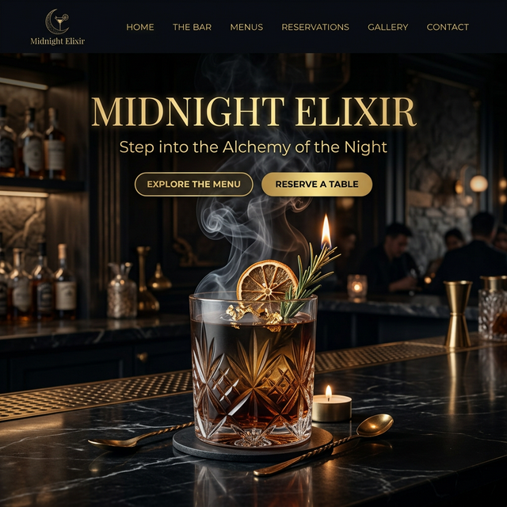

# 🍸 Midnight Elixir

**Midnight Elixir** is a premium cocktail restaurant & bar web experience, designed and built using the cutting-edge philosophy of **Vibe Coding**. This project showcases a high-end interactive portal that blends sophisticated aesthetics with modern web technologies.

**Live Experience:** [https://midnight-elixir.vercel.app/home.html](https://midnight-elixir.vercel.app/home.html)

[](https://midnight-elixir.vercel.app/home.html)

## ✨ Features

- **Interactive Portal**: A sleek entry point highlighting the core experiences of the venue.
- **Visual Menu**: A beautifully curated digital menu featuring signature cocktails and small bites.
- **Reservation System**: A streamlined, intuitive booking interface for guests.
- **Responsive Design**: Fluid layouts that adapt seamlessly across devices.
- **Premium Aesthetics**: Dark-mode primary UI with gold accents, inspired by luxury nightlife.

## 🛠 Built With

This project was developed through the power of **Vibe Coding**, leveraging advanced AI-first design and development tools:

- **[Google Stitch](https://stitch.withgoogle.com/)**: Used for rapid UI prototyping and vision-to-code generation.
- **[Google's Antigravity (Gemini)](https://antigravity.google/)**: The core intelligent coding assistant that implemented the logic, styling, and structural integrity.
- **HTML5 & Vanilla CSS**: Utilizing modern CSS variables, Grid, and Flexbox for maximum performance and flexibility.
- **JavaScript**: Handling local interactions and navigation flows.

## 🎨 Inspiration

The design language of Midnight Elixir draws inspiration from high-end creative platforms:
- [Awwwards](https://www.awwwards.com/) - For overall UX excellence.
- [Dribbble](https://dribbble.com/) - For visual styling and color harmony.

## 🚀 Getting Started

To explore the project locally:

1. Clone the repository:
   ```bash
   git clone https://github.com/sharathyd/Midnight-Elixir.git
   ```
2. Navigate to the project folder:
   ```bash
   cd Midnight-Elixir
   ```
3. Open `index.html` in your favorite browser.

## 🥂 Credits

- **Design & Code**: Developed by [sharathyd](https://github.com/sharathyd) in collaboration with Antigravity AI.
- **Concept**: A study in modern digital lounge experiences.

---
*Created with Mid-level Vibes and High-level Logic.*
